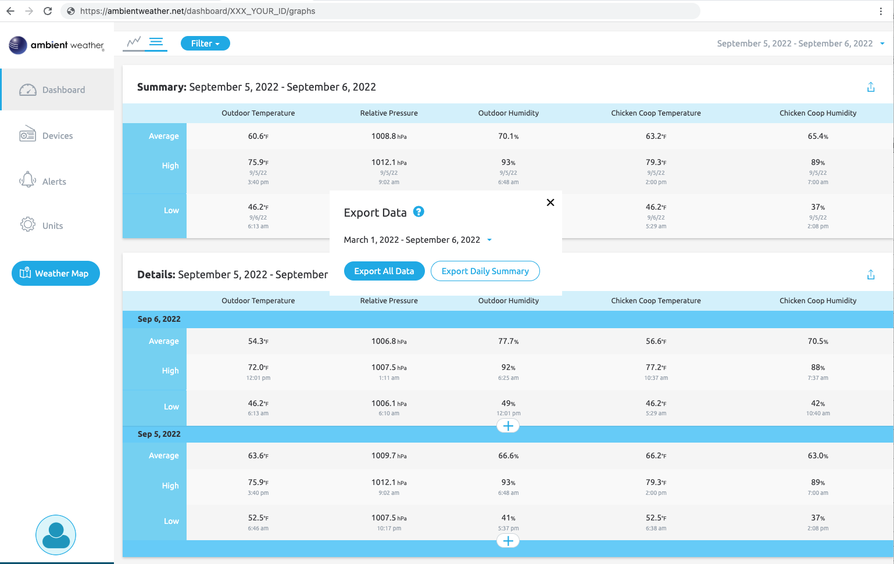

AmbientWeather2GrowingDegreesDays
====

http://oregonviticulture.net/gdd/gdd.html

This tool takes in the data available from ambient weather's CSV output and parses out the parts that give us the data for calculating the Growing Degree Days.

